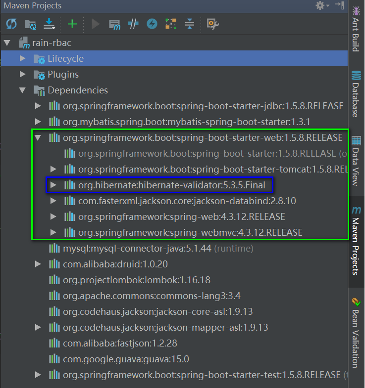

#### SpringBoot中自定义CustomBeanValidator
* 效果图如下：


* 自定义BeanValidate
```java
package com.jhon.rain.helper;

import com.google.common.base.Preconditions;
import com.google.common.collect.Lists;
import com.google.common.collect.Maps;
import org.apache.commons.collections.MapUtils;

import javax.validation.ConstraintViolation;
import javax.validation.Validation;
import javax.validation.Validator;
import javax.validation.ValidatorFactory;
import java.util.*;

/**
 * <p>功能描述</br> 自定义的bean的校验器 </p>
 *
 * @author jiangy19
 * @version v1.0
 * @FileName CustomBeanValidator
 * @date 2017/11/18 14:38
 */
public class CustomBeanValidator {

	private static ValidatorFactory validatorFactory = Validation.buildDefaultValidatorFactory();

	/**
	 * <pre> 校验器 </pre>
	 *
	 * @param t
	 * @param groups
	 * @param <T>
	 * @return
	 */
	public static <T> Map<String, String> validate(T t, Class<?>... groups) {
		Validator validator = validatorFactory.getValidator();
		Set<ConstraintViolation<T>> validateResult = validator.validate(t, groups);
		if (validateResult.isEmpty()) {
			return Collections.emptyMap();
		} else {
			LinkedHashMap errors = Maps.newLinkedHashMap();
			Iterator<ConstraintViolation<T>> iterator = validateResult.iterator();
			while (iterator.hasNext()) {
				ConstraintViolation<T> violation = iterator.next();
				errors.put(violation.getPropertyPath().toString(), violation.getMessage());
			}
			return errors;
		}
	}

	/**
	 * <pre>集合的校验</pre>
	 *
	 * @param collection
	 * @return
	 */
	public static Map<String, String> validateList(Collection<?> collection) {
		Preconditions.checkNotNull(collection);
		Iterator<?> iterator = collection.iterator();
		Map errors;

		do {
			if (!iterator.hasNext()) {
				return Collections.emptyMap();
			} else {
				Object object = iterator.next();
				errors = validate(object, new Class[0]);
			}
		} while (errors.isEmpty());
		return errors;
	}

	/**
	 * <pre>统一的校验方法 </pre>
	 *
	 * @param first
	 * @param objects
	 * @return
	 */
	public static Map<String, String> validateObject(Object first, Object... objects) {
		if (objects != null && objects.length > 0) {
			return validateList(Lists.asList(first, objects));
		} else {
			return validate(first, new Class[0]);
		}
	}

	/**
	 * <pre>VO参数的校验入口</pre>
	 *
	 * @param param
	 */
	public static void check(Object param) {
		Map<String, String> map = CustomBeanValidator.validateObject(param);
		if (MapUtils.isNotEmpty(map)) {
			throw new RbacParamException(map.toString());
		}
	}
}
```

* 引入依赖


* 自定义RBACParamException,实现异常的统一拦截
```java
package com.jhon.rain.base;

import com.jhon.rain.constants.RespCodeConstants;
import com.jhon.rain.helper.RbacParamException;
import com.jhon.rain.helper.ResponseData;
import com.jhon.rain.helper.ResponseUtil;
import org.springframework.web.bind.annotation.ControllerAdvice;
import org.springframework.web.bind.annotation.ExceptionHandler;
import org.springframework.web.bind.annotation.RestController;

import javax.servlet.http.HttpServletRequest;

/**
 * <p>功能描述</br> 全局的异常处理器 </p>
 *
 * @author jiangy19
 * @version v1.0
 * @FileName GlobalExceptionHandler
 * @date 2017/11/18 15:28
 */
@ControllerAdvice
@RestController
public class GlobalExceptionHandler {

	@ExceptionHandler(value = RbacParamException.class)
	public ResponseData<?> rbacParamsValidateExceptionHandler(HttpServletRequest request,
	                                                          RbacParamException paramException) {
		return ResponseUtil.error(RespCodeConstants.REQUEST_PARAMS_VALIDATE_EXCEP, paramException.getMessage());
	}
}

```

* 编写测试类

    * ViewObject
    ```java
    package com.jhon.rain.pojo.vo;
    
    import lombok.Data;
    import org.hibernate.validator.constraints.Length;
    import org.hibernate.validator.constraints.NotBlank;
    
    import javax.validation.constraints.Max;
    import javax.validation.constraints.Min;
    import javax.validation.constraints.NotNull;
    
    /**
     * <p>功能描述</br> 系统用户VO</p>
     *
     * @author jiangy19
     * @version v1.0
     * @FileName SysUserVO
     * @date 2017/11/18 15:05
     */
    @Data
    public class SysUserVO {
    
        private Integer id;
    
        @NotBlank(message = "用户名不能为空")
        @Length(min = 1, max = 20, message = "用户名长度需要在20个字以内")
        private String username;
    
        @NotBlank(message = "电话不能为空")
        @Length(min = 1, max = 13, message = "电话长度需要在13个字以内")
        private String telephone;
    
        @NotBlank(message = "邮箱不能为空")
        @Length(min = 5, max = 50, message = "邮箱长度需要在20个字以内")
        private String mail;
    
        @NotNull(message = "必须提供用户所属部门")
        private Integer deptId;
    
        @NotNull(message = "必须指定用户的状态")
        @Min(value = 0, message = "用户的状态不合法")
        @Max(value = 2, message = "用户状态不合法")
        private Integer status;
    
        @Length(min = 0, max = 200, message = "备注的长度需要在200个字以内")
        private String remark = "";
    }
    ```

    * 控制器
    ```java
    package com.jhon.rain.controller;
    
    import com.jhon.rain.entity.SysUser;
    import com.jhon.rain.helper.ResponseData;
    import com.jhon.rain.helper.ResponseUtil;
    import com.jhon.rain.pojo.dto.SysUserDTO;
    import com.jhon.rain.pojo.vo.SysUserVO;
    import com.jhon.rain.service.SysUserService;
    import lombok.extern.slf4j.Slf4j;
    import org.springframework.beans.factory.annotation.Autowired;
    import org.springframework.web.bind.annotation.*;
    
    import javax.xml.ws.Response;
    import java.util.List;
    
    /**
     * <p>功能描述</br> 用户控制器 </p>
     *
     * @author jiangy19
     * @version v1.0
     * @FileName SysUserController
     * @date 2017/11/15 9:09
     */
    @RestController
    @RequestMapping("/sys/user")
    @Slf4j
    public class SysUserController {
    
        @Autowired
        private SysUserService sysUserService;
    
        /**
         * <pre>查询用户信息</pre>
         *
         * @param id 用户主键
         * @return
         */
        @RequestMapping("/{id}")
        public ResponseData<SysUser> getRecordById(@PathVariable(name = "id", required = true) Integer id) {
            log.info("INFO Log Level,UserId={}", id);
            return ResponseUtil.success(sysUserService.findById(id));
        }
    
        /**
         * <pre>查询所有的记录</pre>
         * @return
         */
        @RequestMapping("/list")
        public ResponseData<List<SysUser>> getRecords() {
            return ResponseUtil.success(sysUserService.findAll());
        }
    
        /**
         * <pre>新增用户</pre>
         * @param sysUserVO
         * @return
         */
        @PostMapping
        public ResponseData<SysUserVO> save(@RequestBody SysUserVO sysUserVO){
            return ResponseUtil.success(sysUserService.save(sysUserVO));
        }
    }
    ```