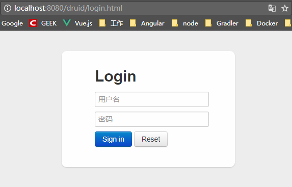
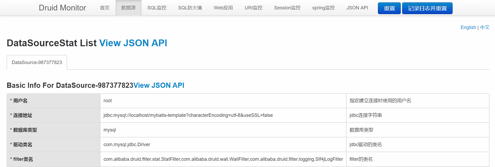

#### 基于RBAC模式权限项目实战
[](https://www.travis-ci.org/YuJhon/Rain-RBAC)

Spring Boot + MyBatis 

##### 配置Druid的依赖
```xml
<dependency>
    <groupId>com.alibaba</groupId>
    <artifactId>druid</artifactId>
    <version>1.0.20</version>
</dependency>
```
##### Datasource数据源的扩展配置
```yml
spring:
  datasource:
    # mysql配置
    driver-class-name: com.mysql.jdbc.Driver
    username: root
    password: root
    url: jdbc:mysql://localhost/mybatis-template?characterEncoding=utf-8&useSSL=false

    # Druid配置
    type: com.alibaba.druid.pool.DruidDataSource
    # 下面为连接池的补充设置，应用到上面所有数据源中
    # 初始化大小，最小，最大
    initialSize: 1
    minIdle: 3
    maxActive: 20
    # 配置获取连接等待超时的时间
    maxWait: 60000
    # 配置间隔多久才进行一次检测，检测需要关闭的空闲连接，单位是毫秒
    timeBetweenEvictionRunsMillis: 60000
    # 配置一个连接在池中最小生存的时间，单位是毫秒
    minEvictableIdleTimeMillis: 30000
    validationQuery: select 'x'
    testWhileIdle: true
    testOnBorrow: false
    testOnReturn: false
    # 打开PSCache，并且指定每个连接上PSCache的大小
    poolPreparedStatements: true
    maxPoolPreparedStatementPerConnectionSize: 20
    # 配置监控统计拦截的filters，去掉后监控界面sql无法统计，'wall'用于防火墙
    filters: stat,wall,slf4j
    # 通过connectProperties属性来打开mergeSql功能；慢SQL记录
    connectionProperties: druid.stat.mergeSql=true;druid.stat.slowSqlMillis=5000
    # 合并多个DruidDataSource的监控数据
    useGlobalDataSourceStat: true

mybatis:
    type-aliases-package: com.jhon.rain.entity
    mapper-locations: classpath:mapper/*.xml
```

##### 配置DruidConfiguration和SpringBoot集成
```java
package com.jhon.rain.config;

import com.alibaba.druid.support.http.StatViewServlet;
import com.alibaba.druid.support.http.WebStatFilter;
import org.mybatis.spring.SqlSessionFactoryBean;
import org.springframework.beans.factory.annotation.Qualifier;
import org.springframework.boot.autoconfigure.jdbc.DataSourceBuilder;
import org.springframework.boot.context.properties.ConfigurationProperties;
import org.springframework.boot.web.servlet.FilterRegistrationBean;
import org.springframework.boot.web.servlet.ServletRegistrationBean;
import org.springframework.context.annotation.Bean;
import org.springframework.context.annotation.Configuration;
import org.springframework.context.annotation.Primary;
import org.springframework.core.io.support.PathMatchingResourcePatternResolver;
import org.springframework.dao.annotation.PersistenceExceptionTranslationPostProcessor;

import javax.sql.DataSource;
import java.io.IOException;

/**
 * <p>功能描述</br> Druid数据源的配置 </p>
 *
 * @author jiangy19
 * @version v1.0
 * @FileName DruidConfiguration
 * @date 2017/11/16 11:31
 */
@Configuration
public class DruidConfiguration {

	@Bean
	public ServletRegistrationBean statViewServlet() {
		ServletRegistrationBean servletRegistrationBean = new ServletRegistrationBean(new StatViewServlet(), "/druid/*");
		/** 白名单 **/
		servletRegistrationBean.addInitParameter("allow", "127.0.0.1");
		/** IP黑名单 **/
		servletRegistrationBean.addInitParameter("deny", "192.168.1.244");
		/** 登录查看信息的账号密码 **/
		servletRegistrationBean.addInitParameter("loginUsername", "jhonrain");
		servletRegistrationBean.addInitParameter("loginPassword", "jhonrain1321");
		/** 是否能够重置数据 **/
		servletRegistrationBean.addInitParameter("resetEnable", "false");
		return servletRegistrationBean;
	}

	@Bean
	public FilterRegistrationBean statFilter() {
		FilterRegistrationBean filterRegistrationBean = new FilterRegistrationBean(new WebStatFilter());
		/** 添加过滤规则 **/
		filterRegistrationBean.addUrlPatterns("/*");
		/** 添加不需要忽略的格式信息 **/
		filterRegistrationBean.addInitParameter("exclusions", "*.js,*.gif,*.jpg,*.png,*.css,*.ico,/druid/*");
		return filterRegistrationBean;
	}

	@Bean
	PersistenceExceptionTranslationPostProcessor persistenceExceptionTranslationPostProcessor() {
		return new PersistenceExceptionTranslationPostProcessor();
	}

	@Bean(name = "datasource")
	@Primary  // 该Bean优先被注入
	@ConfigurationProperties(prefix = "spring.datasource")
	public DataSource dataSource() {
		return DataSourceBuilder.create().type(com.alibaba.druid.pool.DruidDataSource.class).build();
	}

	@Bean
	public SqlSessionFactoryBean sqlSessionFactory(@Qualifier("datasource") DataSource dataSource) throws IOException {
		SqlSessionFactoryBean sqlSessionFactoryBean = new SqlSessionFactoryBean();
		sqlSessionFactoryBean.setDataSource(dataSource);
		PathMatchingResourcePatternResolver resolver = new PathMatchingResourcePatternResolver();
		sqlSessionFactoryBean.setMapperLocations(resolver.getResources(dao));
		return sqlSessionFactoryBean;
	}
}
```

##### 效果展示




后续完善...